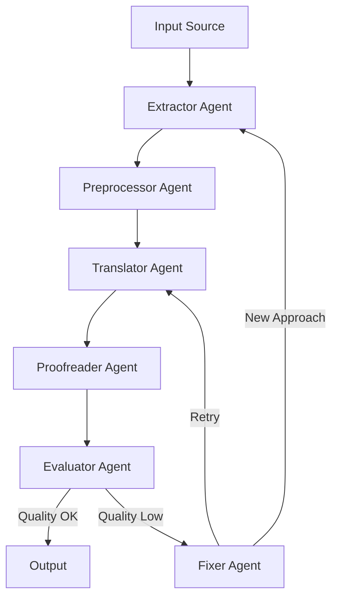

# Document Pipeline System - Agent Architecture

This document outlines the agent-based architecture of the Document Pipeline System, describing how different specialized agents work together to process and transform documents into high-quality Japanese text.

## Core Agents

### 1. Extractor Agents

#### YouTube Agent (`youtube_caption_or_audio`)
- **Primary Role**: Extract content from YouTube videos
- **Capabilities**:
  - Auto-caption extraction using `yt-dlp`
  - Audio download and transcription fallback
  - Language detection and translation routing
- **Output**: Raw text with metadata including `{source_type, video_id, caption_used}`

#### PDF Agent (`marker_pdf`)
- **Primary Role**: Extract text from digital PDFs
- **Capabilities**:
  - Text layer extraction
  - Layout preservation
  - Metadata extraction
- **Output**: Structured text with formatting hints

#### OCR Agent (`marker_ocr_pdf`)
- **Primary Role**: Process scanned PDFs
- **Capabilities**:
  - Image preprocessing
  - OCR text extraction
  - Layout analysis
- **Output**: Raw text with confidence scores

#### Audio Agent (`whisper_large`)
- **Primary Role**: Transcribe audio content
- **Capabilities**:
  - Multi-format audio support (MP3, WAV, M4A)
  - Speaker diarization
  - Timestamp preservation
- **Output**: Transcribed text with speaker labels

#### Web Agent (`trafilatura_web`)
- **Primary Role**: Extract content from web pages
- **Capabilities**:
  - Main content extraction
  - Metadata harvesting
  - HTML cleaning
- **Output**: Clean text with source metadata

### 2. Processing Agents

#### Preprocessor Agent
- **Primary Role**: Text normalization and cleanup
- **Capabilities**:
  - Line break restoration
  - OCR error correction
  - Format standardization
- **Output**: Normalized text ready for translation

#### Translator Agent
- **Primary Role**: Language conversion
- **Capabilities**:
  - Source language detection
  - Japanese translation
  - Cultural adaptation
- **Output**: Japanese text with translation metadata

#### Proofreader Agent (`gpt-4o`)
- **Primary Role**: Quality assurance
- **Capabilities**:
  - Grammar checking
  - Style consistency
  - Readability improvement
- **Output**: Polished text with quality scores

### 3. Quality Control Agents

#### Evaluator Agent
- **Primary Role**: Quality assessment
- **Capabilities**:
  - LanguageTool integration
  - Readability scoring
  - BLEU score calculation
- **Output**: Quality metrics and recommendations

#### Fixer Agent
- **Primary Role**: Error correction
- **Capabilities**:
  - Pattern-based error detection
  - Context-aware corrections
  - Alternative approach suggestion
- **Output**: Corrected text or alternative processing path

## Agent Communication

### Message Flow


### Quality Control Loop
1. Evaluator Agent assesses output quality
2. If quality < threshold:
   - Fixer Agent attempts correction
   - If improvement < min_improvement:
     - Try alternative extractor
     - Or flag for manual review
3. Maximum 3 retry attempts

## Agent Configuration

### Quality Thresholds
```yaml
pipeline:
  quality_threshold: 0.85  # Minimum acceptable quality
  max_retries: 3          # Maximum retry attempts
  min_improvement: 0.01   # Minimum quality improvement per retry
  language_tool_threshold: 0.02  # Maximum grammar error rate
  bleu_threshold: 35.0    # Minimum BLEU score for translations
```

### Agent Profiles
```yaml
agents:
  extractor:
    youtube:
      caption_priority: true
      fallback_to_audio: true
    pdf:
      ocr_confidence: 0.8
    whisper:
      model: "large-v3"
      language: "ja"
  
  processor:
    translator:
      model: "gpt-4"
      temperature: 0.7
    proofreader:
      model: "gpt-4"
      style: "general"
```

### Configuration Precedence

The project loads configuration values in the following order:

1. **Command line options** (`--output-dir`, `--config`) override all other settings.
2. If `--config` is omitted but a `config.yaml` file exists in the working directory, its values are used.
3. When neither of the above is provided, the defaults defined in `docpipe.config.Config` apply.

All configuration is loaded via `Config.load()`, ensuring consistent behavior across the project.

## Error Handling

### Agent Failures
1. **Extractor Failure**:
   - Log error with context
   - Try alternative extractor if available
   - Raise exception if no alternatives

2. **Processing Failure**:
   - Save intermediate state
   - Attempt recovery with simpler processing
   - Flag for manual review if unrecoverable

3. **Quality Control Failure**:
   - Log quality metrics
   - Attempt alternative quality checks
   - Escalate to manual review if necessary

## Monitoring and Metrics

### Agent Performance
- Processing time per document
- Success/failure rates
- Quality score distribution
- Resource utilization

### System Health
- API usage and quotas
- Error rates and types
- Retry statistics
- Cost tracking

## Future Enhancements

### Planned Agent Additions
1. **Image Agent**:
   - OCR for images
   - Layout analysis
   - Text extraction

2. **Social Media Agent**:
   - Platform-specific extractors
   - Comment thread handling
   - Media context preservation

3. **Batch Processing Agent**:
   - Parallel processing
   - Resource optimization
   - Progress tracking

### Agent Improvements
1. **Self-Learning**:
   - Quality pattern recognition
   - Error prediction
   - Adaptive thresholds

2. **Collaborative Processing**:
   - Agent knowledge sharing
   - Cross-agent optimization
   - Distributed processing
